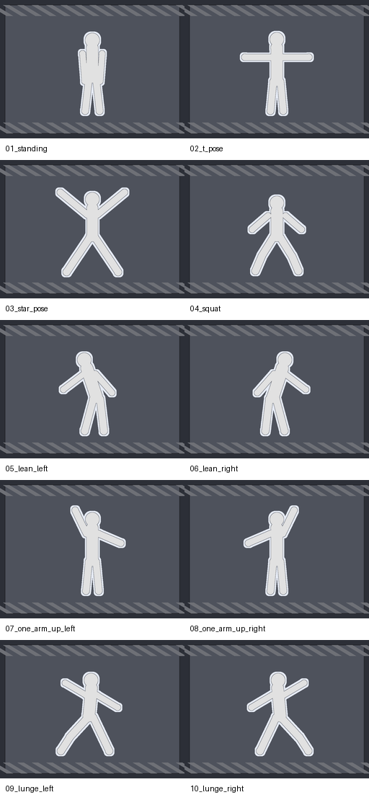

[README_TetrisCave2026.md](https://github.com/user-attachments/files/30835653/README_TetrisCave2026.md)
# TetrisCave / CAVE-Projekt 2026

TetrisCave ist ein Kinect-basiertes Human-Tetris-Spiel für die CAVE der HTW Berlin. Die spielende Person wird über Kinect erfasst und muss ihren Körper so positionieren, dass sie durch poseförmige Öffnungen in heranfahrenden Wänden passt. Erfolgreich durchquerte Wände geben Punkte, während eine Berührung mit der Wand ein Leben kostet.

Das Spiel verbindet körperliche Bewegung mit der immersiven CAVE-Technologie und überträgt das bekannte Prinzip von „Human Tetris“ in eine interaktive, räumliche Spielumgebung.

## Konzept

Das Projekt verfolgt das Ziel, ein körperlich aktives Spiel zu entwickeln, bei dem die eigene Bewegung direkt zum Eingabegerät wird. Statt Controller oder VR-Brille wird der Körper der spielenden Person durch eine Kinect V2 getrackt und als Avatar bzw. Skelettmodell in Unity verarbeitet.

Während des Spiels bewegen sich Wände mit unterschiedlichen Körperposen auf die Person zu. Die transparente Fläche einer Wand bildet die Pose, durch die sich der Spieler bewegen muss. Passt der getrackte Körper durch die Öffnung, wird die Wand erfolgreich gewertet. Berührt ein Körperteil die Wand, verliert die Person ein Leben.

Durch die CAVE-Technologie (Cave Automatic Virtual Environment) findet das Spiel in einer begehbaren Projektionsumgebung statt. Ein physisches Podest dient zur Steuerung des Start- und Game-Over-Menüs. Zusätzlich begleitet der Avatar „Blocky“ das Spiel mit Hinweisen, Feedback und Quizfragen.

## Zielsetzung der Features

- Kinect-Tracking der spielenden Person und Übertragung der Körperbewegung auf einen Avatar
- Heranfahrende Wände mit unterschiedlichen poseförmigen Öffnungen
- Erfolgreiches Durchqueren einer Wand: +100 Punkte
- Wandberührung durch ein Körperteil: Verlust eines Lebens
- Start mit 3 Leben und Game Over bei 0 Leben
- Dynamisch steigende Schwierigkeit durch schnellere und dichter aufeinanderfolgende Wände
- Speicherung eines Highscores
- Steuerung über ein physisches CAVE-Podest ohne sichtbaren Cursor
- Begleit-Avatar „Blocky“ mit Spielhinweisen und Feedback
- Sprachbasiertes Quiz in regelmäßigen Punkteabständen
- Tastatur-Fallback zum Testen ohne Kinect-Hardware

## Technische Umsetzung

- Unity Version: [2022.3.59f1]
- Kinect for Windows SDK: Kinect V2
- CAVE Package – für multiwandige Projektionsumgebung und Kinect Tracking  
  [→ Zum CAVE-Package der HTW Berlin](https://github.com/FKI-HTW/CAVE#upm)
- Whisper Unity – für die Spracherkennung im Quiz
- Ollama – optional für die Auswertung gesprochener Quizantworten

Die Kinect erfasst die Körperposition und Gelenkdaten der spielenden Person. Das vorhandene CAVE-Tracking und `PositionTransferMultiple.cs` übertragen diese Daten auf die virtuelle Darstellung des Körpers.

Die Wände werden während des Spiels automatisch erzeugt und bewegen sich auf die Spielerebene zu. Ihre Öffnungen basieren auf transparenten Bereichen der Wandgrafiken. `WallColliderBuilder.cs` wertet den Alphakanal dieser Grafiken aus und erzeugt daraus passende Collider, sodass erkannt werden kann, ob der Körper die Wand berührt oder erfolgreich durch die Öffnung gelangt.

Die zentrale Spielszene befindet sich unter:

`Assets/Scenes/CaveGame.unity`

Beim ersten Öffnen des Projekts übernimmt `Assets/Editor/CaveGameSetup.cs` automatisch wichtige Einrichtungsschritte wie Layer-Konfiguration, Wand-Importeinstellungen und Build-Szene.

## Projektstruktur und Skripte

### 1. `GameManager.cs`

> Funktion: Steuert den gesamten Spielablauf, die Spielzustände, Leben und Punkte. Das Skript wird vom `GameBootstrapper` automatisch erzeugt und mit den anderen Spielsystemen verbunden.

- Verwaltet die Zustände `MainMenu`, `WaitingForPlayerTracking`, `Playing` und `GameOver`
- Startet eine Runde mit standardmäßig 3 Leben
- Vergibt standardmäßig 100 Punkte pro erfolgreich durchquerter Wand
- Zieht bei einem Wandtreffer ein Leben ab
- Beendet die Runde bei 0 Leben
- Verwendet `HumanTetrisHighscore` für Punktestand und Highscore
- Unterstützt einen Tastatur-Fallback mit Enter bzw. Leertaste zum Testen ohne Kinect

---

### 2. `WallSpawner.cs`

> Funktion: Erzeugt während des Spiels fortlaufend Wände mit poseförmigen Öffnungen und steuert deren Platzierung sowie die ansteigende Schwierigkeit.

- Lädt die Wandgrafiken automatisch aus `Assets/TetrisCave/Walls/Resources/Walls/`
- Enthält aktuell zehn unterschiedliche Pose-Wände
- Platziert die Wände vor dem Spieler und bewegt sie in Richtung Spielerebene
- Passt die Wandgröße optional an die getrackte Körpergröße an
- Erhöht im Spielverlauf Geschwindigkeit und Spawn-Frequenz
- Verwaltet Kalibrierungswerte wie `wallCenter`, `playerPlaneZ` und `targetWorldHeight`
- Lädt den Fehler-Sound bei einer Wandberührung

---

### 3. `WallColliderBuilder.cs`

> Funktion: Erstellt aus den transparenten Bereichen der Wandgrafiken passende Collider für die Kollisionserkennung.

- Liest den Alphakanal der jeweiligen Wand-Textur
- Unterscheidet zwischen massiver Wand und transparenter Körperöffnung
- Erzeugt mehrere `BoxCollider` zur Annäherung an die Wandform
- Ermöglicht dadurch eine körperbezogene Treffererkennung statt eines einzelnen rechteckigen Colliders
- Genauigkeit und Aufwand können über Rasterauflösung und Alpha-Schwellenwert angepasst werden

---

### 4. `KinectPlayerPresence.cs`

> Funktion: Prüft, ob eine Person zuverlässig von der Kinect erkannt wird, bevor das eigentliche Spiel startet.

- Liest den Tracking-Zustand aus dem CAVE-/Kinect-System
- Verhindert bei aktiviertem Tracking-Zwang einen Spielstart ohne erkannte Person
- Übergibt den Tracking-Status an den `GameManager`
- Ermöglicht zusammen mit dem Tastatur-Fallback Entwicklung und Tests ohne angeschlossene Kinect

Zusätzlich wird `PositionTransferMultiple.cs` aus dem bestehenden TetrisCave-/CAVE-Aufbau verwendet, um Kinect-Gelenkdaten auf die virtuellen Körperteile des Avatars zu übertragen.

---

### 5. `PhysicalStartPodestController.cs`

> Funktion: Steuert das physische CAVE-Podest für den Start des Spiels sowie die Auswahlmöglichkeiten nach dem Game Over.

- Ersetzt die Sample-Buttons durch die benötigten Spielbuttons
- Erkennt beide getrackten Hände in einer räumlichen Aktivierungszone
- Startet das Spiel nach kurzem Halten der Hand über dem Button
- Arbeitet ohne sichtbaren Maus- oder Handcursor
- Zeigt nach Game Over getrennte Möglichkeiten für Neustart und Zurück zum Menü
- Enthält Toleranzen gegen Kinect-Zittern und kurze Tracking-Aussetzer

---

### 6. `AvatarCompanion.cs`

> Funktion: Steuert den Begleit-Avatar „Blocky“, der die spielende Person durch das Spiel führt und Rückmeldungen gibt.

- Zeigt Hinweise im Startmenü
- Weist auf den Startknopf hin
- Bewegt sich während des Spiels durch die CAVE
- Kommentiert erfolgreiche Wände, Serien und Fehler
- Warnt beim letzten verbleibenden Leben
- Zeigt Rückmeldungen beim Game Over
- Dient während des Quiz als sichtbare Figur für Fragen und Antworten

---

### 7. `AvatarQuizController.cs`

> Funktion: Startet in regelmäßigen Punkteabständen ein Sprach-Quiz und pausiert währenddessen das eigentliche Spiel.

- Startet standardmäßig alle 1000 Punkte eine Quizfrage
- Lädt die Fragen aus `Assets/Resources/Quiz/QuizQuestions.asset`
- Pausiert die Spielbewegung während einer Frage
- Nutzt Whisper zur Transkription der gesprochenen Antwort
- Kann Ollama zur zusätzlichen Antwortbewertung verwenden
- Fällt bei nicht verfügbarem Ollama auf einen lokalen Antwortvergleich zurück
- Das Quiz verändert weder den Punktestand noch die Anzahl der Leben

Das Whisper-Modell selbst ist nicht Bestandteil des Repositorys und muss separat unter folgendem Pfad abgelegt werden:

`Assets/StreamingAssets/Whisper/ggml-small.en.bin`

## Verwendete Assets

- Wandgrafiken: zehn Pose-Wände unter `Assets/TetrisCave/Walls/Resources/Walls/`
- Wand-Masken: Referenzmasken unter `Assets/TetrisCave/Walls/Hole_Masks/`
- Avatar: `Assets/TetrisCave/Models/Resources/Avatar/tetris01.fbx`
- 3D-Modelle: unter anderem `bodenT2.fbx`, `bodenT3.fbx` und `T_Cube.fbx`
- Materialien und Shader: eigene TetrisCave-Materialien sowie `SpaceCubemapInverted.shader`
- Sounds: `FalseSound.mp3` und `GameOverSound.mp3`
- CAVE Assets: vorhandene Assets aus dem CAVE-Package der HTW Berlin
- Quizfragen: `Assets/Resources/Quiz/QuizQuestions.asset`
- Whisper: `com.whisper.unity` für Speech-to-Text; das benötigte Modell wird separat eingebunden

